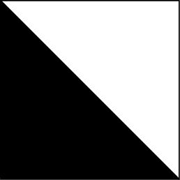
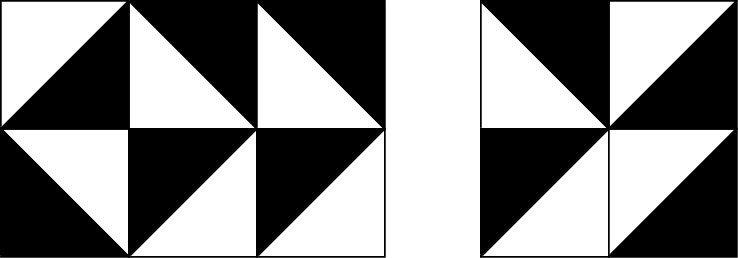

# Tiles

Bob is decorating his kitchen, more precisely, the floor. He has found a prime candidate for the tiles he will use. They come in a simple form factor—a square tile that is diagonally split into white and black part as depicted in the figure below.

The dimension of this tile is the perfect for this kitchen, as he will need wxactly $w\times{h}$ tiles without any scraps. That is, the width of the kitches is $w$ tiles, and the height is $h$ tiles. As each tile can be rotated in one of four ways, he still needs to decide on how exactly he will tile the floor. There is a single aesthetic criterion that he wants to fulfill: two adjacent tiles must not share a colour on the edge—i.e. one of the tiles must have a white colour on the shared border, and the second one must be black.

<i>

The picture on the left shows one valid tiling of a $3\times{2}$ kitchen. The picture on the right shows an invalid arrangement, as the bottom two tiles touch with their white parts.

</i>

Find the number of possible tilings. As the number may be large, output its remainder when divided by $998244353$ (a prime number).

## Input

The only line contains two separated integers $w$, $h$ ($1\leq{w,h}\leq{1000}$)—the width and height of the kitchen, measured in tiles.

## Output

Output a single integer $n$—the remainder of the number of tilingswhen divided by $998244353$.
